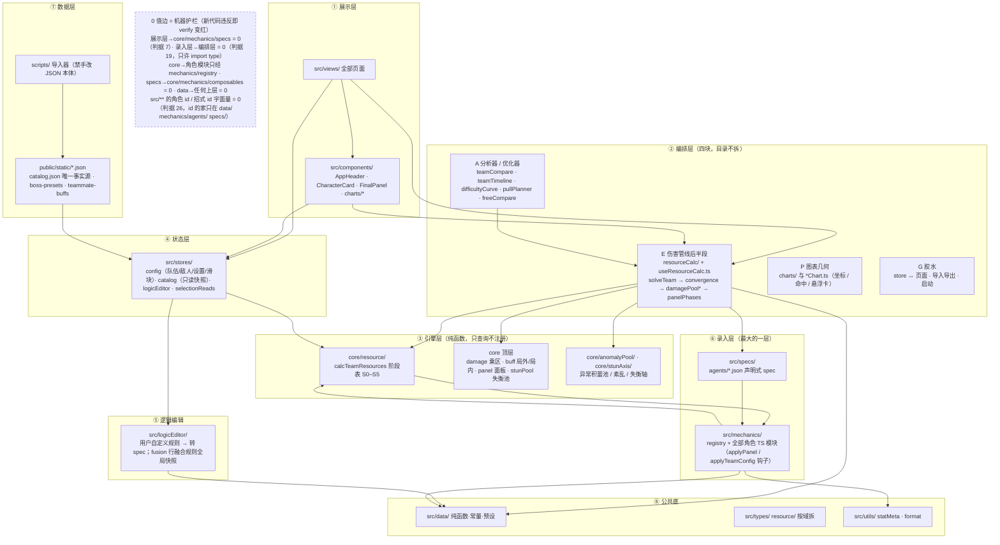
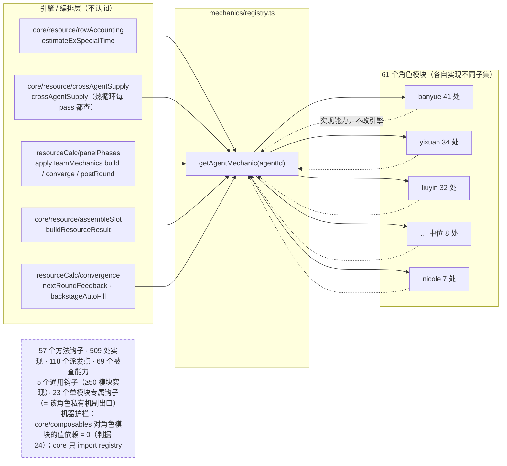
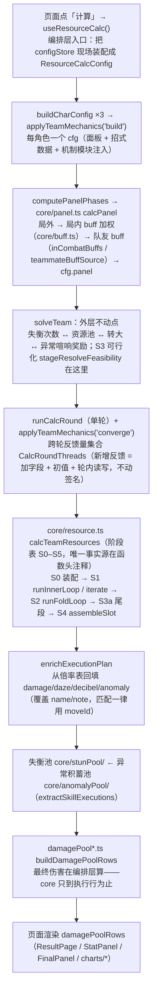
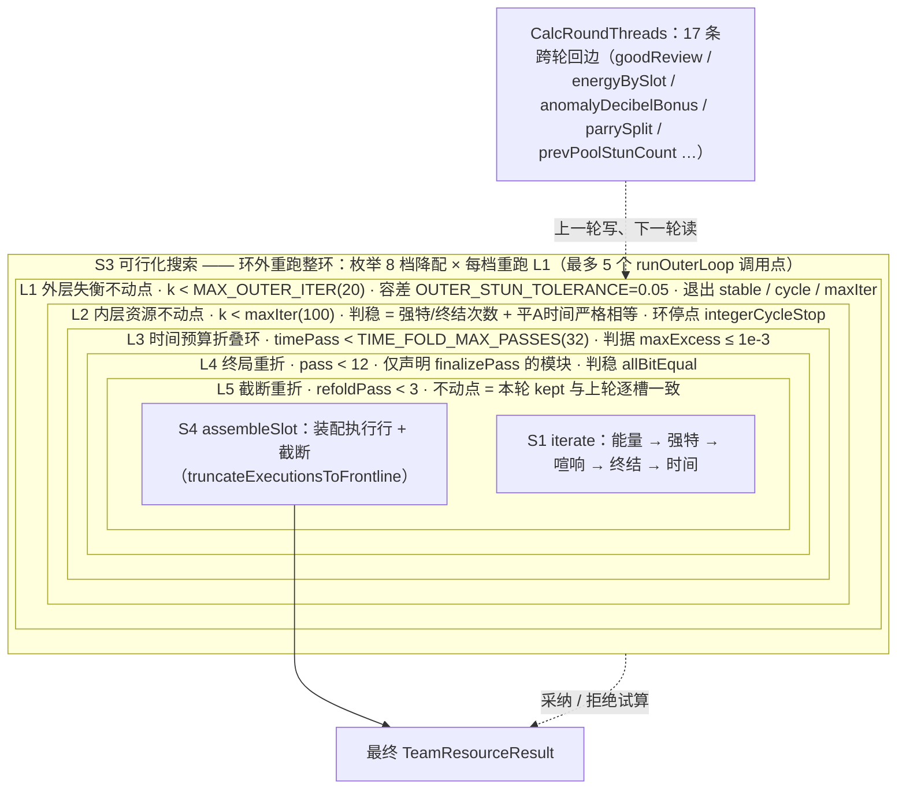

# 代码架构地图（AI 导航用）

> 本文不是代码百科全书——只回答一个问题：**"我拿到一个任务，该读哪些文件？"**
> 细节（乘区公式、钩子语义、口径）在代码注释与测试里，文档不重复。
> 配套阅读：`ENGINE_PIPELINE_GUIDE.md`（一轮计算的数据流/钩子/坑）、`AGENT_RECORDING_SOP.md`（角色录入）。
> 阅读顺序建议：本文（地图）→ ENGINE_PIPELINE_GUIDE（管线）→ 按任务进对应层。

## 0. 心智模型：八层 + 单向依赖

**层与层之间不是「上一层调用下一层」这么简单**：引擎与 61 个角色模块之间是**多对多**——
模块声明能力，引擎按能力查询（`getAgentMechanic(id)?.<能力>`），不认 id：

**带实测文件数 / 行数 / 值边条数的图版**：`docs/architecture-layers.svg`（浏览器直接开）。
数字由 `node scripts/gen-architecture-diagrams.mjs` 现场测量生成并随 HEAD 自动对时——**别手抄数字进本文**（抄了就静默过期）。

依赖方向：展示 → 编排 → 引擎；录入层被编排/引擎经 registry 消费；数据层被状态层加载。
（编排层目录**不按四块拆分**：挪约 60 个文件的 import、行为零变化；「管线后半段并入 core」的前提：① **store 依赖已清零**（CC-245：resourceCalc/ 从不调用 useXStore，store 实例由 useResourceCalc 注入；运行时闭包进入 stores/ 只剩纯函数 selectionReads，锁 `resourceCalcStoreDeps.test`）；② 仍未满足：运行时闭包依赖 mechanics 注册表与全部角色模块、`logicEditor/fusion`（经 data/moveTableQueries 的全局快照）——core 禁止依赖这两者（原第三项 `composables/agentMechanicView` 已由 CC-246 消除：AUTO_AXIS_PRESET_HINTS 迁入 mechanics/registry，锁同上），并入须改注入。不在 R6 内开（清点见 docs/mcp-r6-refactor-list.md §8 第 266 行）。决定见 docs/mcp-r6-refactor-list.md §5。）
**引擎只查询、不注册**：`src/core/**` 取角色模块只许 `import { getAgentMechanic } from '@/mechanics/registry'`，不许按值 import `@/mechanics`（index，会加载并注册全部角色模块，而角色模块又 import core ⇒ 环）；注册副作用只在入口：浏览器 `src/main.ts` 的 `import '@/mechanics'`，测试 `vite.config.ts` `test.setupFiles`。新增运行入口（Worker / node 脚本）必须自己 import `@/mechanics`。守卫：`src/core/__tests__/coreMechanicsRegistryOnly.test.ts`（R6 C1，第 139 轮）。
**录入层对编排层只许 `import type`**（值边必成环：R35 实测 `claret → resourceCalc/helpers → mechanics/index → claret`）；
录入层要用编排层的纯函数一律**下沉 `src/data/`**（`data/moveTableQueries.ts` 先例——招式查找 / 行值 / 融合行值 / 平A 第 3 段；
`src/data/` 是各层都可依赖的公共底），导入方同批改到 `src/data/`，原位置不留转出壳（非入口文件转出即红，`scripts/lib/dead-channel-ls.mjs#REEXPORT_ENTRY_FILES`）。机器面 = 判据 19 `layer-inversion`
（`scripts/lib/layer-inversion.mjs` 头注释是口径唯一事实源：值导入 0 + 反空洞下限 + `claret.ts` 形状锁）。
**新 AI 读代码的捷径：从上往下读一遍调用链（页面 → useResourceCalc → core），每个文件头注释就是它的职责声明。**

**分层规则 → 锁**（CC-248 汇总；每条口头规则都有对应的机器锁，新写代码违反时 verify 变红。闭包锁共用 `src/test/importClosure.ts#runtimeImportOffenders`，只计值 import，跳过 `import type`）：

| 规则 | 口径 | 锁 |
|---|---|---|
| core 取角色模块只经 registry | 直接 import | `src/core/__tests__/coreMechanicsRegistryOnly.test.ts` |
| core 纯函数层：闭包不进入 specs / logicEditor / composables / stores / 展示层；mechanics/registry 是纯叶子 | 传递闭包 | `src/core/__tests__/coreRuntimeDeps.test.ts` |
| 管线后半段 resourceCalc 不进入 stores（selectionReads 除外）和上层 composables | 传递闭包 | `src/composables/__tests__/resourceCalcStoreDeps.test.ts` |
| specs 不进入 core / mechanics / composables / stores / 展示层（只白名单 logicEditor/fusion，经 data 带入） | 传递闭包 | `src/specs/__tests__/specsRuntimeDeps.test.ts` |
| data 是公共底：不进入任何上层（只白名单 logicEditor/fusion，N2 裁决） | 传递闭包 | `src/data/__tests__/dataRuntimeDeps.test.ts` |
| 展示层（views / components）不值导入 core / mechanics / specs | 直接 import | check-guards 判据 7 `detectExhibitionLayerImport` |
| 录入层（mechanics / specs）对编排层只许 import type | 直接 import | check-guards 判据 19 `scripts/lib/layer-inversion.mjs` |
| 录入层 mechanics 闭包不进入编排/状态/展示层（specs 与 logicEditor/fusion 为已登记例外） | 传递闭包 | `src/mechanics/__tests__/mechanicsRuntimeDeps.test.ts` |

新增分层约束时优先加闭包锁（照抄上面任一 `*RuntimeDeps.test.ts`），并做反例：临时加一条违规 import，确认变红。

## 1. 一次计算的生命周期（点「计算」→ 出图）

**上面这条只是主干**（页面 → 出图的数据流）。P3–P5 那三步**不是顺序执行的三步，而是七个嵌套的收敛环**——
真正决定数值的是环的嵌套与回边，不是这条链：

**这不是流水线**：外层三环（L1–L3）是**嵌套不动点**，内层两环（L4–L5）由模块声明按需触发，
S3 在**所有环之外**重跑整环。实测全库 104 队：`outerExit` stable=99 / cycle=5，
折叠环 2~12 轮，`timeBudgetConverged=false` 0 队（`PROBE_CONV_SCAN=1` 探针，命令见 `convergenceProbe.test.ts` 头注释）。

图版（含 S1–S4 各阶段在 `core/resource/` 下的落点与时间截断口径）：`docs/architecture-calc-flow.svg`；
非线性结构总览（嵌套环 + 多对多派发 + 分析器扇出 + 验证网）：`docs/architecture-runtime.svg`；
逐步函数级对账（哪个函数在哪一行）见 `docs/ARCHITECTURE-OVERVIEW.md` §6.1。

关键对象流转：`configStore.team` → `CharacterOperationConfig`（cfg，可被模块改写）→ `TeamResourceResult`（characters[].executions/energySource/...）→ `damagePoolRows`（展示行）。

## 2. 运行时拓扑：三处非线性（图版 `docs/architecture-runtime.svg`）

层图（§0）回答「谁在哪层」；这一节回答「**为什么结构上不是线性并列**」。三处非线性各自有机器护栏兜着，改的时候知道自己在动哪一处：

### 2.1 嵌套收敛环（七个环，不是一个循环）

主干链上的 P3–P5 实际是**同心嵌套**：外层环里跑内层环，最内的叶子上才真正「算一次」。
`S3 可行化搜索` 在**所有环之外**重跑整环（枚举 8 档降配 × 每档一次 `runOuterLoop`）。

| 环 | 位置 | 循环变量 | 退出判据 | 实测 |
|---|---|---|---|---|
| S3 可行化搜索 | `solveTeam.ts:429` | 降配档 `DOWNSCALE_SCALES`（8 档） | 三臂不更差 + 枚举取最大可行；锁窗一律不动 | 最多 5 个 `runOuterLoop` 调用点 |
| L1 外层失衡不动点 | `solveTeam.ts:200` | 失衡次数 | `MAX_OUTER_ITER=20` · 容差 `OUTER_STUN_TOLERANCE=0.05` · 退出 `stable/cycle/maxIter` | 104 队：stable 99 / cycle 5 |
| L2 内层资源不动点 | `innerLoop.ts:108` | 强特/终结次数 + 平A时间 | `INNER_LOOP_MAX_ITERATIONS=100` · 判稳严格相等 · 环停点 `integerCycleStop` | 正常队 ≤15 轮退出 |
| L3 时间预算折叠环 | `foldLoop.ts:74` | `cfg.timeBudgetExcess / timeBudgetRefund` | `TIME_FOLD_MAX_PASSES=32` · `maxExcess ≤ 1e-3` | 2~12 轮 |
| L4 终局重折 | `finalizePasses.ts:78` | 声明 `finalizePass` 的模块 | `FINALIZE_MAX_PASSES=12` · 判稳 `allBitEqual` | 按模块声明触发 |
| L5 截断重折 | `truncationRefold.ts:73` | `cfg.rowTimeLimit` | `ROW_REFOLD_MAX_PASSES=3` · 不动点 = kept 逐槽一致 | 仅超预算队 |
| L6 转大/连携窗口不动点 | `ultimatePromote.ts:318`（`promoteFixpoint`） | 好评 → 60/90 转大次数 ↔ 连携窗口 ↔ 失衡池次数 | `MAX_PROMOTE_ITER=8` · 有界单调必收敛 | 有转大提供者的队才走 |

**回边（跨轮反馈）**：`CalcRoundThreads` 17 个字段上一轮写、下一轮读（`goodReview` / `energyBySlot` /
`anomalyDecibelBonus` / `parrySplit` / `prevPoolStunCount` …）。**新增反馈 = 加字段 + 初值 + 轮内读写**，
不动 `runCalcRound` 签名。

**别把三本时间账当一本**（同一队可差 90s，UI 只报其中一本）：预算 / 账本 / 物化行——
口径母表在 `ENGINE_PIPELINE_GUIDE.md` §4 开头。

### 2.2 多对多钩子派发（引擎不认 id）

**62 个模块对象**（61 个文件，`specPanelBuffs.ts` 一个文件导出 2 个）× **57 个方法钩子** = **509 处实现**，
引擎侧 **112 个按能力查询的派发点**、**66 个被查能力**：

- **5 个通用钩子**（几乎所有模块都实现）：`buildCharConfig`(61) · `applyPanel`(54) · `buildExecutions`(54) · `resourceSections`(53) · `buildResourceResult`(52)
- **23 个单模块专属钩子** = 该角色私有机制的出口（如 `giftedPolarAssaultCount` / `endsStunWindow` / `promoteHugCounts` / `curtainTriggers`）
- **模块规模差异极大**：最重 `banyue` 41 处、最轻 `nicole` 7 处（中位 8 处）——所以「加个钩子」的代价在模块侧是分摊的

**三种派发顺序并存，都是有意的**（改派发器前先确认你在哪一种里）：
`applyTeamConfig` / `nextRoundFeedback` = **槽位升序**（写入式，顺序影响结果）；
`axisWindowOverlays` = **注册表顺序**（取值式，顺序无关）；`teamMechanicSlots` = **注册顺序**（明文不是槽位序）。

**同一钩子会在一个 pass 里被调多次**（别假设幂等）：`estimateExSpecialTime` 每槽 3 次/轮、
`selfBurnDecibel` 2 处、`curtainTriggers` 在 `iterate` 每 pass 与装配各一次。

**`applyTeamConfig` 的三个相位不是同一批 cfg 对象**：build / converge 在本轮克隆的 cfg 上；
**postRound 派发的是下一轮新克隆的 cfg**（旧写法在轮末对本轮克隆派发，下一轮重新克隆即丢失）。

纪律：`core/**` 与 `composables/**` 对角色模块的**值依赖 = 0**（判据 24 硬门）；
core 只许 `import { getAgentMechanic } from '@/mechanics/registry'`（不许 import `@/mechanics` index，会成环）。

### 2.3 分析器扇出（一次出结果 = 跑 N 次整条管线）

上层分析器站在整条管线**之上**反复调用，这是第四层（规划里叫「应用层」）：

- 全部经 `AnalysisContext`（`config` + `calc`）拿管线——**12 个 composables** 声明该契约、**6 个页面**经 `withAnalysisScenario` 隔离
- 为什么不能直接用 active Pinia store：分析器要**反复改写配置再求值** ⇒ 场景出生态（`effectScope` 隔离，判据 `analysisScenario.test`）
- 代价量级（代码注释实测）：时间权重 ≈ 15~20 次求值/队（≈1.5s/队）；难度爬梯探针每队约 3~4s
- **真正的成本不在单次求值，而在「求值次数 × 环内轮数」**：一次 `calcTeamResources` 内部是 §2.1 的七层环
  （实测折叠环 2~12 轮），所以一个分析器扫 20 个候选 ≈ 几百次内层迭代——改分析器时先看它的候选集大小

**扇出后扇入**：结果汇到 6 个页面（`TeamComparePage` / `TimeChartsPage` / `FreeComparePage` /
`ResourceUtilizationPage` / `PositionComparePage` / `RunArchivePage`）。

### 2.4 验证网（为什么敢动这些环）

| 层 | 锁 |
|---|---|
| 分层 | 8 条闭包/直接依赖锁（`coreMechanicsRegistryOnly` / `coreRuntimeDeps` / `resourceCalcStoreDeps` / `specsRuntimeDeps` / `dataRuntimeDeps` / **`mechanicsRuntimeDeps`** / 展示层不值导入 / `layer-inversion`）——四层（core / specs / data / mechanics）现在都有传递闭包锁 |
| 棘轮与硬门 | 判据 7 · 19 · 22 · 23 · 24 · 25 · 26（id 字面量 0 / 值依赖 0 / 死读 0） |
| 全局回归网 | `allAgentsSweep`（全角色 × 命座 0/6 不变量）· `timeGolden`（105 预设时间账）· `timeFillRatchet`（留白棘轮） |
| 证据链 | 原文契约 `data/recordings/` · `validate:specs` 逐条认定消费 · `verify:recording` 交付闸门 |

**收敛体检怎么自己跑**：`PROBE_CONV_SCAN=1 npx vitest run src/composables/__tests__/convergenceProbe.test.ts`
（全预设分布）；单队 `PROBE_CONV_TEAM=<预设id> …`（冷/热/换队回来三读数）。

## 3. 核心类型地图

> 2026-09-11 起 `types/resource.ts`（原 2567 行单文件）已按域拆为 `types/resource/` 目录
> （`time` / `energy` / `agentResources` / `execution` / `team` / `config` / `pools` + `index.ts` barrel）。
> **下游一律写 `@/types/resource`**（85 个文件，路径零改动）；新增类型放进对应域文件并在 barrel re-export。
> 定位口诀：资源账本→`energy`/`agentResources`，执行行→`execution`，收敛诊断→`team`，引擎输入面→`config`，
> 失衡/异常/紊乱/轴→`pools`。

| 类型 | 职责 | 谁产生 / 谁消费 |
|---|---|---|
| `PanelValues` | 角色面板（属性/乘区/敌方减益全字段，索引签名） | computePanelPhases 产生 → cfg.panel / 伤害池消费 |
| `CharacterOperationConfig` | 单角色计算配置（可被机制模块改写）——公共字段在 `types/resource/config.ts`，单模块私有字段在各 `mechanics/agents/<x>.ts` 末尾的 `declare module` 扩充块（CC-359） | buildCharConfig 产生 → 引擎 + 模块钩子消费 |
| `IterationState` | 单轮迭代状态（次数/时间分配）——`types/resource/time.ts` | iterate 产生/消费 |
| `SkillExecution` | 执行计划一行（moveId/倍率/时间/增伤字段）——`types/resource/execution.ts` | buildExecutions 产生 → enrich 回填 → 各池消费 |
| `TeamResourceResult` | 队伍资源结果（characters[] + executions + specResources）——`types/resource/team.ts` | calcTeamResources 产生 → 页面/池消费 |
| `CharacterResourceResult` | 单角色资源结果（energySource/decibelSource/专属字段）——`types/resource/agentResources.ts` | 同上 |
| `StunAxis` / `StunAxisAction` | 失衡轴定义（槽位/动作/转大变体）——`types/resource/pools.ts` | 用户/预设产生 → 轴引擎消费 |
| `ResourceCalcConfig` | 全局计算配置（totalTime/stunCount/盾数）——`types/resource/config.ts` | useResourceCalc 产生 |

## 4. 任务 → 文件决策树

| 任务 | 先读 | 再改 |
|---|---|---|
| **优化角色自动理解 / 原文录入流程 / 证据契约** | `AGENT_RECORDING_SOP.md` §0.5；`node scripts/record-agent.mjs --help` | `scripts/lib/recording.mjs`（固定来源与校验接口）+ `scripts/record-agent.mjs`（工作台）+ `scripts/verify-recording.mjs`（交付闸门）；测试 `src/scripts/__tests__/recording.test.ts` |
| 录新角色 / 补机制 | `AGENT_RECORDING_SOP.md` §0.5 先建 `data/recordings/<id>.json`，plan 校验后 → `ENGINE_PIPELINE_GUIDE.md` | `src/specs/agents/<agentId>.json`（**文件名必须 = agentId**，validate:specs 强制）+ `src/mechanics/agents/<id>.ts`（注册进 `mechanics/index.ts`） |
| **跨角色 / 队伍级联动**（邻位回能、后场全队增益、入场次数汇总） | `ENGINE_PIPELINE_GUIDE.md` §2 的 `applyTeamConfig` 三阶段表 | **只改角色模块自己的 `applyTeamConfig`**；派发器 `applyTeamMechanics`（composables/resourceCalc/panelPhases.ts）无需改。禁止往 `useResourceCalc` 加 agentId 分支 |
| **引擎内热循环要用到角色专属量**（赠链时间、跨槽回能等——`iterate`/折叠环每 pass 重算，**钩子派发不进去**） | `src/mechanics/types.ts` 的 `crossAgentSupply` 契约（字段与语义单源）+ `docs/ENGINE_PIPELINE_GUIDE.md` §2 | **模块声明能力，引擎按能力查询**：模块写 `crossAgentSupply`，引擎调 `crossAgentSupplyAt`/`crossAgentSuppliesOf`（`core/resource/crossAgentSupply.ts`）与 `findCrossAgentSupplySlots`。**禁止**在 `core/**` 写 `c.agentId === '<id>'` 或 import 角色模块（两条棘轮盯着，见 `scripts/check-guards.mjs`） |
| **编排层 / core 想读某个角色的专属量**（任何 `<角色前缀>Xxx` 字段、局部量、import 路径） | 判据 22 **已清零为硬门**（2026-09-27 CC-40，`scripts/lib/core-role-field-ratchet.mjs`，口径见 `docs/mcp-r22d1-batch12-field-census.md` §5.42）；**判据 23**（2026-09-27 CC-43b，同文件）另数标识符**中缀**角色名（驼峰切段，如 `applyLiuyinPromote`）与 core **子目录**，立尺基线 13，只减不增（2026-09-27 CC-43c 后为 0，**已转硬门**：BASELINE 0 / frozen 0），还款卡 CC-43c–f 见 census §5.47/§5.48 | 在 `src/mechanics/types.ts` 声明**模块能力**（范例：`stunRefundRatio`、`giftedPolarAssaultCount`、`endsStunWindow`），由角色模块实现，编排层用 `getAgentMechanic(agentId)` 派发；跨轮量走 `moduleFeedback` 通用键；面板量用**通用名**（如 `selfAssaultCritDmgBonus`、`veilStunCapMult`）。**不要**下调口径或加豁免来绕过 |
| **编排层 / core 想用某个角色模块里的函数/常量**（`import … from '@/mechanics/agents/<角色>'`） | **判据 24 硬门**（2026-09-27 CC-45，`scripts/lib/layer-import-ratchet.mjs` 末段）：`src/core/**` 与 `src/composables/**` 对角色模块的**值依赖**必须为 0（多行 import/export、裸 import、动态 import 都计；`import type` / `export type` 豁免） | 逻辑专属的 → types.ts 加可选能力、角色模块实现、编排层 `getAgentMechanic(agentId)?.<能力>` 派发（范式 CC-43c `promoteHugCounts`）；无角色语义的纯函数 → 迁 `src/core`（范式 CC-44 `core/resource/targetSlot.ts`） |
| **角色模块从 cfg 按字符串键读量**（`const record = cfg as unknown as Record<string, unknown>` 后读 `record.xxx`） | **判据 25**（2026-09-27 CC-91，`scripts/lib/record-key-dead-reads.mjs` 头注释）：该键全仓除读取外零出现 ⇒ 红（事故：薇薇安 `vivianDanceHit`/`vivianAssistCount` 零写入恒 0） | 同时写好写入方（模块 `buildCharConfig` 或编排层注入）；能用已有类型字段（如 `cfg.parryCount`）就别新造键；确属有意的存量才登记 `RECORD_KEY_DEAD_READ_ALLOWLIST`（guard-registries.mjs） |
| **任何地方想写角色 / 招式 id 字面量**（`agentId === '1471'` / `moveId === '1371020'` / `['1581'].includes(id)`，页面、编排层、core、store 都算） | **判据 26 硬门 0**（2026-10-04 CC-449 展示层 → CC-450 全 src，`scripts/lib/id-literal-gate.mjs` 头注释）：`src/**` 除 `data/` `mechanics/agents/` `specs/`（id 的家）与测试外，任何被引号包着的四位 `1xx1` / 七位 `1xx1xxx` 都红（注释不计）。范式：模块声明（`axisWindowLane` / `axisDurationInputs` / `characterCountInputs` / `axisNonDecibelUltimates`，CC-65 / CC-446 / CC-448）+ `getAgentMechanic(id)?.<能力>`（引擎 / 编排层）或 `composables/agentMechanicView.ts` 门面（展示层） | `src/mechanics/types.ts` 加能力 / 声明字段 → 角色模块声明 → 消费方按能力查。**页面默认选中的角色 / 招式**唯一落点 `src/data/viewAgentDefaults.ts`；**招式级数据表**（融合 / 变体 / 持续强特 / 标准倍率表）落 `src/data/*.ts` |
| **加一个可调滑块（覆盖率/次数近似）** | `src/mechanics/types.ts` 的 `MechanicSetting`；面板阶段读法见 `AgentPanelInput.settings` | 模块 `settings: [...]` 声明 → 面板阶段 `input.settings['<id>']`、cfg 阶段 `configStore.getMechanicSetting`。**必须补一条「滑块改了面板/结果确实变」的生效测试**（般岳 rageGainCoverage 曾静默失效） |
| **角色模块（录入层）要用编排层 `composables/**` 里的函数**（招式查找 / 行值 / 平A基准段一类） | `scripts/lib/layer-inversion.mjs` 头注释（判据 19 口径 + 实测病灶）；落点 `src/data/moveTableQueries.ts` 头注释 | **禁止值导入 `@/composables`**（只许 `import type`，判据 19 即红）：纯函数/常量下沉 `src/data/`，导入方同批改过去、原位置不留转出壳（`deadChannelLs.test` ⑫ 转出口径即红）；**不要**在角色模块重建同形函数（分裂单一事实源）。判据 `src/scripts/__tests__/layerInversion.test.ts` + `src/scripts/__tests__/deadChannelLs.test.ts` ⑫ |
| 改伤害公式 / 乘区 | `core/damage.ts`（乘区顺序 = 代码顺序，逐项清单见 `core/damage.ts#calcDirectDamage` 的 @fact engine:damage/乘区顺序） | core/damage.ts；执行级字段在 `types/resource/execution.ts` SkillExecution |
| 改资源池（能量/闪能/时间/连携/转大） | `core/resource.ts`（主循环）→ `core/resource/helpers.ts`（calcEnergySource/iterate） | 同上 + `types/resource/config.ts`；**跨角色回能只改 `calcCrossAgentEnergy`**（单一事实源，两处消费与历史事故见 helpers.ts 函数头注释） |
| **改计算核心的「阶段 / 先后顺序」** | `core/resource.ts#calcTeamResources` 函数头的**阶段表（S0–S5）** 是唯一事实源（每阶段：名字 / 位置 / 输入→输出 / 判据）；S1 四步见 `core/resource/helpers.ts#iterate` 头注释；已抽出的命名阶段 = `core/resource/innerLoop#runInnerLoop`(S1) / `core/resource/foldLoop#runFoldLoop`(S2，诊断量经 `resource/solveDiagnostics#SolveDiagnostics` 注入) / `composables/useResourceCalc#stageResolveFeasibility`(S3) | 顺序不可交换（逐阶段语义以阶段表为准，本文不抄副本）；改动只落在对应阶段；与 `ENGINE_PIPELINE_GUIDE.md` §1 数据流同源 |
| 改合轴率/时间预算抵扣/超时判定 | `core/resource/helpers.ts` 的 `iterate`（抵扣+池+单角色≤180 cap+截断份额水填回流）与 `netFrontlineOccupation`（超时判定单一事实源） | 口径见 `ENGINE_PIPELINE_GUIDE.md` §4 坑 21；生效测试 `comboAlignBudget.test.ts`；NET 模块必标 `comboAlignIncludedInNecessary: false` |
| **排查「时间分配吃不满 180s」/ 改欠打回填** | `core/resource.ts` 折叠循环之后的**末轮欠打回填**块（`UNDERFILL_PROBE_THRESHOLD_SECONDS`）→ `iterate` 的 `availableBasicTime` | **三条纪律（门槛容差 / 可行性优先于留白 / 热启动只存规范种子）的权威 = §4 坑 19①，本文不抄**；另见坑 22（必要前台封顶并回灌平A池，轴模式除外）。生效测试 `underfillRefund.test.ts` + `timeTruncation.test.ts`；**全库留白由 `timeFillRatchet.test.ts` 棘轮钉住**（`TIME_RATCHET_UPDATE=1` 重生成基线） |
| **改「时间线截断」/ 出现小数次数 / 招式行消失** | `core/resource/timeTruncation.ts`：`truncateExecutionsToFrontline`（装配入口，平A先占位）→ `truncateMoveRows`（整数装包；账本侧 `feasibleRows` 直接调它） | 口径见 §4 坑 22；生效测试 `timeTruncation.test.ts`；模块侧读 `cfg.timePressureSeconds`，**不要读 `timeBudgetExcess`** |
| **改结果页「时间分配汇总」卡** | `composables/teamTimeSummary.ts`（纯函数：账本口径 vs 物化口径 + 留白归因 + **「时间截断」逐行清单**） | 页面只渲染；生效测试 `teamTimeSummary.test.ts`（恒等式 + 归因 + 无敌缩预算 + 截断逐行可见）；「时间截断 X s / N 条行」= 装配期真被砍掉的量、旧文案「超预算」是错的——口径见 `teamTimeSummary.ts` 的 `overflow` 字段注释 + `core/resource.ts#calcTeamResources` 的 @fact engine:资源账本/截断 |
| 排查「界面能量总额和次数不对应」 | `types/resource/energy.ts` 的 `CrossAgentEnergy` / `derivedEnergy` 注释 | 看 `energySource.total`（展示，含 crossAgent）vs `derivedEnergy`（驱动次数）；两口律试已对齐（iterate 连携次数同口径，`timeSliceChainEnergy.test.ts` 锁定），差值 ≠ 0 即回归 |
| 排查「算出来没收敛 / 数值抖动」 | `types/resource/team.ts` 的 `ConvergenceReport`；`composables/resourceCalc/outerCycle.ts`（本轮反馈快照/二周期判据）；结果页计算状态条 | `convergence.timeBudgetConverged` / `outerExit`（`cycle` 是容差内的环代表、不是严格固定点；`maxIter` 可疑）；判据 `outerCycle.test.ts` + 真管线相位/锁窗 `outerFeedbackRegression.test.ts`；全角色不变量 `allAgentsSweep` |
| 改失衡 / 异常 / 紊乱 | `core/stunPool/`、`core/anomalyPool/` | 同上 |
| 改面板计算 / 局外局内 / 转模 | `composables/resourceCalc/panelPhases.ts`（computePanelPhases，applyPanel 调用点在此）→ `core/panel.ts` | 同上 |
| **压缩数组取值**（队伍有**空槽**时数值静默偏小/直接报 TypeError —— 本类缺陷 `timeGolden` 全盲，105 预设全满槽） | `scripts/lib/compacted-slot-index.mjs` 头注释（判据 17 的口径与全部实测证据） | `characters`/`panels`/`damagePanels`/`entrySnapshotPanels` **按位置压缩**（producer 跳过空槽）⇒ **槽位号 ≠ 下标**，一律禁 `arr[slot]`：① 模块内取**自己**那份 ⇒ 用派发器直给的 `AgentTeamConfigInput.cfg` / `AgentNextRoundFeedbackInput.cfg`；② **队友**那份 ⇒ `.find(c => c.slot === slot)`；③ 面板族 ⇒ `panelAt(panels, slot)`（`core/panel.ts`，按 `PanelValues.slot` 印章查）。依不变量「**有 cfg 必有面板**」⇒ 取不到应**响亮失败**，禁止静默 `continue`/`?? 兜底`。生效测试 `src/composables/__tests__/compactedSlotIndex.test.ts`（前导/中间空槽 + 3 个原硬崩角色；**必须手组队**，预设库覆盖不到） |
| **排查「招式单次时长/喧响比同族小一个量级」（连携显示 0.5s 一类）** | `core/resource/moveLookup.ts` 的 `fusedGroupMetrics`（@fact engine:fusedGroupMetrics/一次动作整段量）+ `channelMetricsOf`（全部 `find*` 的唯一出口）；`data/moveFusions.ts` 登记组 + `countsTime` | 口径见 `ENGINE_PIPELINE_GUIDE.md` §4 坑 31 + 上述 @fact；生效测试 `moveFusion.test.ts`（含双计护栏） |
| **静态数据失败/重试、首屏迟到初始化覆写编辑** | [catalog](src/stores/catalog.ts) 的加载状态/去重 + [calculatorStartup](src/composables/calculatorStartup.ts) 的启动 Interface | [CalculatorView](src/views/CalculatorView.vue) 只在完整启动后挂编辑页；[config](src/stores/config.ts) 的 `initDefaultTeam` 自身保护编辑。判据：[catalogReadiness](src/stores/__tests__/catalogReadiness.test.ts) + [calculatorStartup](src/composables/__tests__/calculatorStartup.test.ts)；不得把 error 当 ready 或取消预设的推荐门 |
| **独立装配配置，不借用 active Pinia** | [config](src/stores/config.ts) 的 `createConfigModel(catalogReader)` | UI `useConfigStore` 只是 Adapter；调用方管理 effectScope。判据：[configModel](src/stores/__tests__/configModel.test.ts)（无 active Pinia 仍能装配且 UI state 不变）。可选第二参数 `initialState` = 独立场景出生态（在依赖 state 的 watcher 注册前写入，CC-343） |
| **分析器要改配置再求值（不碰 UI 现场）** | [analysisScenario](src/composables/analysisScenario.ts) 的 `withAnalysisScenario` / `createAnalysisScenario`；资源计算工厂 `useResourceCalc.ts#createResourceCalc(config, catalog)` | 页面建场景，分析器只收 `AnalysisContext`（config + calc），不调 `useConfigStore()`、不做快照恢复。判据：[analysisScenario](src/composables/__tests__/analysisScenario.test.ts)（出生态 = 源现场及反例、隔离、等值、源码锁）。第 1 阶段只迁了角色兑现曲线，其余分析器仍走 `configSnapshot`，进度见 `docs/mcp-analyzer-scenario-isolation.md` §4 |
| 改页面 / 结果展示 | `views/` + `components/`；伤害行数据源 `calc.damagePoolRows` | 对应 .vue |
| **逻辑编辑器 JSON 导入 / 缓存恢复 / 保存失败 / 撤销重做** | `logicEditor/validation.ts`（同源运行时解码）+ `logicEditor/storage.ts`（恢复与安全写入） | `stores/logicEditor.ts`（有效快照隔离、会话历史与无效草稿回退）+ `views/LogicEditorPage.vue`（对象身份草稿、快捷键边界）；判据 `logicEditor/__tests__/{validation,storage}.test.ts` + `stores/__tests__/{logicEditor,logicEditorHistory}.test.ts` + `scripts/ui-logic-editor-check.mjs`；操作见 `FEATURES_GUIDE.md` §9 |
| **改难度曲线 / 伤害-难度图型** | `composables/difficultyLadder.ts`（目标集 **G1 权重均衡 / G2 弹刀·联合 / G3 保底 / G4 取整 / G5 合轴率优化（自动·repeatable；**v4 两档 = 先「刚好包容」溢出、再封顶**，无溢出的队直接封顶——用户 2026-10-05 口径）** + 逐目标贪心爬梯，纯策略；`opts.base` 可换「全关」基线、`opts.costOf` = 实测操作难度）+ `composables/difficultyCurve.ts`（展示层：散点口径基线 + 纯函数 `buildCurveChart`）。**x 轴口径（时间压力/截断存活率/配装固定/x 不保证单调）的权威 = `difficultyCurve.ts` 顶部 @fact 与 `teamCompare.ts:130` 注释，本文不抄副本** | 页面 `views/TeamComparePage.vue` 图型「难度曲线」；判据 `__tests__/difficultyCurve.test.ts` + `difficultyLadder.test.ts`；切轴档 = `preset.altAxes`（`difficultyCurve#makeAltAxisGoal`，般琉卢 10大轴为首个用户）；探针 `PROBE_DIFF_LADDER=1`（每队约 3~4s）；UI 点通命令见 AGENTS §3（`--radio 难度曲线 --click 计算曲线 --wait-for .curve-seg`） |
| **改「选第三人」（固定 2 队友 + 候选范围扫第三槽）** | `composables/teamTimeline.ts` `computeSlotSweepPoints`（Chart 7 求值口径推广到任意三元组；候选 = `candidateIds` 覆盖，缺省 `slotSweepCandidates`；**单队求值单一事实源 `evalTeamByBudget`**——口径与 skipped 处理见其函数注释；不含当期 buff/自动下位 = 与 Chart 7 同口径） | 页面 `views/TeamComparePage.vue` 图型「选第三人」（候选圈定 = 职业多选〈空=全部，默认异常〉+ 可手选子集；伤害降序排名表 + 占比背景条）；判据 `__tests__/slotSweep.test.ts` |
| 命座提升率 / 死数据自检 | `composables/cinemaUplift.ts`（`analyzeCinemaUplift`，页面与测试同源） | 同上；全角色红灯在 `allAgentsSweep`「命座有效性不变量」 |
| 改失衡轴 / 自动轴 / 预设 | `data/stunAxisPresets.ts` + `data/stunAxisPresets/*.json` | 同上（自动匹配 `selectAutoStunAxisPreset`） |
| 改队伍预设 | `data/teamPresets/*.json`（目录自动加载）；**一级/二级分类口径单源** `scripts/lib/presetCategories.mjs`（一级=输出核心职业队名，二级=该核心属性；用户裁决全文见其头注释）；改口径后 `node scripts/sync-preset-categories.mjs` 回填，自动库重生成 `node scripts/gen-auto-presets.mjs`；**同名队只留一条（`auto-` 为唯一来源）**、**队伍身份 = 成员集合（顺序无关）**：口径与保留判据见 `gen-auto-presets.mjs` 头注释 + @fact engine:preset/队伍身份；判据 `teamPresets.test.ts`「成员集合去重」 | 同上；`validate:data` 逐条重算分类护栏 + `data/__tests__/teamPresets.test.ts` |
| **实战归档对拍 / 验收读数**（某队打几分、几次失衡、几喧响；改收入口径后复核是否自然达标） | `composables/runArchiveDeploy.ts`（`submissionToDeploy` + `applyDeployConfig` 部署链，参照测试 `archiveDeployStun.test.ts`）+ `data/deadlyAssaultScore.ts`（`scoreForDamageRatio`；单房 65000 = 伤害分 60000 + 操作分 5000 的口径见文件头注释） | 一次性 vitest 探针读 `resourceResult.characters[].decibelSource.total` / `ultimateCount`（琉音赠大看 `source==='gift'` 行，**轴模式下可为小数=期望值，正常**）；**归档只作单条部署对照，不作误差判据、不设基线、不据此拦录入改动**（用户裁决 2026-09） |
| **时间图表页（队伍随版本演变）** | `composables/teamTimeline.ts`（精确增量搜索 / 预算感知排名 / 逐金贪婪最优加金（试算 / 提交在 `composables/goldGreedy.ts`，与队伍对比共用）/ maxIter 收敛过滤 / 换人上位·平替判定 `classifySwapUplift`——口径全部见文件头注释；Boss 排期标记 `composables/bossSchedule.ts`）；**Chart 7 同槽位角色对比 = `teamTimeline.ts` `findSlotComparePairs`/`computeSlotComparePoints`** + `data/versionTimeline.ts`（版本节点/S级实装版本）；**Chart 6 抽卡规划器 = `composables/pullPlanner.ts`**（算法与价值归因见文件头注释，纯逻辑 oracle 注入）+ `composables/pullPlannerEngine.ts`（引擎桥）。⚠ **Chart 5（抽卡价值 · 危局兑现）已于 2026-10-08 整体下线**（用户裁决：价值要用计算器算「带卡 vs 不带卡」两队对比，不用统计估计）——`composables/pullValue.ts` / `pullValueChart.ts` / `components/charts/PullValueChart.vue` 已删除，**不要再引入按归档统计的兑现价值图** | `views/TimeChartsPage.vue`；口径见 `FEATURES_GUIDE.md` §4（Chart 6 算法口径 §4.5） |
| **倍率表系数演算记录（角色系数推导）** | `data/standardMultiplierTable.ts`（标准职业稀有度倍率表 + 常驻 S 名单单一来源；系数口径见文件头注释）+ `composables/multiplierCoefficients.ts`（招式分类/期望值/纵向系数中位数/支援突击直伤锚点/招式特定偏差；聚合口径见文件头注释，纯函数页面测试同源） | `views/MultiplierCoeffPage.vue`；口径与待确认项见 `FEATURES_GUIDE.md` §5 |
| **给图表加/改「图例点选筛选」** | `composables/seriesFilter.ts`（`useSeriesFilter()` 唯一实现；三条口径见文件头注释：默认全可见 / 筛选必须传导到派生量〈轴上限·刻度·明细表·排名必须读过滤后集合，否则轴按隐藏数据缩放〉/ 不允许全关） | 页面只喂系列清单。判据 `composables/__tests__/seriesFilter.test.ts`；各页接法清单见 `FEATURES_GUIDE.md` §7.6 |
| **自由对比工作台（自选系列的 x/y 对比）** | `composables/freeCompare/`（四层：`metrics.ts` y 指标注册表 / `axes.ts` x 维度注册表 + 配置码 / `constraints.ts` 条件模型 / `engine.ts` 唯一碰 store 的求值器；无专武档的下位择优调 `composables/downgradeWEngine.ts`，与队伍对比自动下位共用）；**加指标 = 往 `METRICS` 加一行、加 x 维度 = 往 `AXES` 加一行**，页面不感知具体有哪些 | `views/FreeComparePage.vue`（页签「对比·自由对比」）。口径：配置码两位 = 左影画 0-6、右专武精炼 1-5（**右位 0 = 无专武**）；单人系列 = 固定基底队友 + 读该槽位分量（**引擎没有单角色求值入口**） |
| **改 spec / JSON 数据后「改了没生效」或怀疑某条声明被静默丢弃** | `scripts/lib/json-dup-keys.mjs` 头注释（判据 21 的口径与实测事故） | **JSON 同一对象内重复键 ⇒ `JSON.parse` 后者静默覆盖前者**，前一份值直接消失而结果**结构完全合法** ⇒ `validate:data`/`validate:specs`/vitest 全看不见（2026-09-22 事故：`1091.json` 重复 `teamBuffs` 键让「雅 C1 全队积蓄 +20%」失效，3383 测试全绿）。判据 = `check-guards` 判据 21（全库 .json 路径感知查重 + detector 自证 + 反空洞下限），单测 `src/scripts/__tests__/jsonDupKeys.test.ts`；⚠ 修法必须**删掉后出现的那个键**，别用「跑生成脚本重写整份」（生成脚本走 `JSON.parse`，会把先出现的那份静默丢掉） |
| 改数据导入 / 校验 / 文档生成 | `scripts/`（validate-specs / docs:status / 各类 import） + `data/raw/README.md`（中间产物目录约定与消费链路表） | 同上 |
| **共享工作区状态 / 租约 / 收工归属** | `scripts/zc.mjs` 的 Git 读取、租约与 journal；状态目录 `.zc/` 不入库 | 判据 `src/scripts/__tests__/zcWorkspace.test.ts`（隔离真 Git/CLI）+ `zc.test.ts`；Git 快照不等于本车道所有权，路径读取不得 trim |
| **MCP 调用本地子代理 / WSL 派发通道** | `docs/mcp-local-subagent-channel.md`；`AGENTS.md` §5–6；现场模型路由与 profile 配置 | 先核验工具 schema，再经 `wsl_exec` 调用受限 headless → 原生 `subagent`；以子会话实际请求、工具回执与文件差异验收，不改计算器业务层 |
| **按需看 LS 死通道现状 / 新增死字段排查** | `node scripts/zc.mjs dead-channels [--json]`（`scripts/zc-dead-channels.mjs`）；口径在 `scripts/lib/dead-channel-ls.mjs` | 判据 `src/scripts/__tests__/zcDeadChannels.test.ts` + `deadChannelLs.test.ts`；工作台只读、不改扫描规则，新增/空扫描/失败退出 1；存量≠可删 |
| 排查"某 buff / 命座没生效" | `AGENT_RECORDING_SOP.md` §3.5 根因表；页面「命座提升率」自检打标 | 按根因表定位字段消费端 |
| 改音擎 / 驱动盘 / 敌人 / Boss | `public/static/catalog.json`（编译期快照，改数据走 scripts/ 导入脚本，勿手改）；角色特化对齐 `scripts/fix-agent-specialty.mjs`、套装数据/条件元数据 `scripts/patch-disc-sets.mjs` | scripts/ + catalogStore；特化↔专武一致性在 `core/__tests__/catalogData.test.ts`，套装效果可见性在 `utils/__tests__/discEffectRows.test.ts` |
| 改 Boss 预设默认值（无敌时间/秽盾/弹刀总数/控制技组） | `scripts/import-nanoka-bosses.mjs` `BOSS_DEFAULTS`（重跑生成 `public/static/boss-presets.json`） | 弹刀「保底4失衡」反推运行时拆分：`core/parrySplit.ts`（纯函数）+ `useResourceCalc` 外层不动点线程 `prevParrySplit`（般岳 `prevBanyueTopUp` 同款收敛）；口径见 `ENGINE_PIPELINE_GUIDE.md` §4 坑 18 |
| 录/改「控制技（紫光技）× 反制支援」交互替换 | `public/static/boss-presets.json` 的 `defaults.counterAssistGroups`（逐组记招架段数，导入侧 `BOSS_DEFAULTS`）；角色招式配对 `src/data/counterAssists.ts`（@fact data:反制支援/招式配对） | 折算在 store 侧 `stores/config.ts#bossParryTotals`（computed getter，不改编排层）+ 产行 `core/resource/helpers#buildExecutions`（一次动作 = 本体+专属支援突击，融合见 `data/moveFusions.ts`）；判据 `counterAssist.test.ts`，口径见 `ENGINE_PIPELINE_GUIDE.md` §4 坑 18 末段 |
| **把页面里一块 UI/svg 图抽成组件**（时间图表页系列）| 先数该块引用的页面级符号与**共享 class**；`styles/chart-blocks.css` 文件头（为什么共享类不能进全局表）+ 判据 16 头注释 | `src/components/charts/*.vue` + `src/views/timeCharts/*.css`。**零 delta 判据**：CDP 整页 DOM 指纹探针**必须禁 HTTP 缓存并打印加载的 chunk 名**（`python http.server` 不发 Cache-Control ⇒ 会静默量到上一版构建，「零 delta」就成了假结论，实测踩过） |

## 5. 数据流速查

- **cfg**：composables 构建 → 模块 `buildCharConfig` 改写 → **模块 `applyTeamConfig` 改写全队**（跨槽位联动，三阶段 build/converge/postRound）→ 引擎 iterate / buildExecutions 读。模块想在下一轮读自己的值 → 写 cfg 字段（`record.<key>`）。
- **跨角色回能**：唯一事实源 = `core/resource/helpers.ts#calcCrossAgentEnergy`（被 iterate 参与次数推导 + calcTeamResources 最终装配写 `energySource.crossAgent` 并计入 total 共用；两处消费与历史事故见其函数头注释）。新增跨角色回能只改这一处 + `CrossAgentEnergy` 加字段。
- **收敛诊断**：`TeamResourceResult.convergence` 由 core（时间预算层）+ useResourceCalc（失衡外层）共同回填 → 结果页计算状态条 + `allAgentsSweep` 断言。
- **特殊动作/异常喧响奖励**：`calcSpecialActionBonus`（弹刀/闪反/连携/快支档位与伴随 50% 见 `core/resource/helpers.ts` 声明处注释）每轮即时结算、`anomalyPool.perSlotBonus`（异常/紊乱/乱流，含伴随）上一轮回填 → `ResourceCalcConfig` 按槽位注入 → iterate `totalDecibel` 与 `decibelSource` 同口径（`ultimateCount = floor(decibels/ultimateCost)`，见 `core/resource/helpers.ts#iterate`；界面喧响总览 = `decibelSource.total`，不再页面外拼）。失衡触发 20/次归属（每人/全队）无出处，未接入。
- **panel**：`computePanelPhases` 产生（applyPanel + 硬编码块在此）→ `cfg.panel` → 伤害池。**applyPanel 阶段拿不到 configStore/settings**（历史坑与正确读法见 `src/mechanics/types.ts` 的 `AgentPanelInput.settings` 注释 + `ENGINE_PIPELINE_GUIDE.md` §4 坑 1）。
- **executions**：buildExecutions 产生 → `enrichExecutionPlan` 回填（**覆盖 name/note**，匹配一律用 moveId）→ 失衡/异常/伤害池。
- **teammate-buffs**：`public/static/teammate-buffs.json`（采集）+ spec `teamBuffs`（人工）→ `stores/catalog.ts` 合并（spec 优先按 id 去重）→ 面板。
- **config store 只存输入**：随队伍/开关变的派生量做 `createConfigModel` 里的 computed getter，引擎与 UI 同读，**不用 watch 写回 store**（写回 ⇒ 同一字段在同步前后含义不同、读数依赖 flush 时序）。实例：音擎覆盖率展示（r706，`mcp-wengine-coverage-timing.md` §9）、Boss 生效弹刀数 `bossParryTotals`（r708，原 `flush:'sync'` watch 写回 `appliedBoss`）。唯一例外 = 时间权重自动分配写回 `basicAttackTimeWeight`（策略要读伤害做有限差分，放进响应式计算会递归；切 static 不还原是用户 2026-09-10 裁决，见 `timeWeightAllocation.ts#useTimeWeightAutoAllocation`）。输入之间的传播（换队刷新队友 buff 选择、副词条设置重填默认配装）不是派生，照旧用 watch。
- **数值唯一事实源**：`public/static/catalog.json`。改数值 = 改爬取/导入脚本重跑，不是改 JSON 本身。
- **生成产物不变量（2026-08-27，机器强制）**：`public/static/*.json` 必须紧凑写（无缩进），且 `catalog.json` 顶层键必须 == `src/types/catalog.ts` 的 `Catalog` 字段白名单（白名单单一事实源在 `scripts/lib/catalog-fields.mjs`，改字段两侧同步）。护栏 = `scripts/validate-data.mjs`（不变量清单见其「产物不变量」段注释），被 `check`/`verify` 覆盖；再膨胀/再引入 legacy 死键即红，修复入口 `npm run minify:static`（幂等，剔死键 + 紧凑写）。

## 6. 导航技巧

1. **用 grep 找符号，不翻目录**：`grep -rn "computePanelPhases" src/` 一条命令定位生产/消费端，比逐层读文件快一个数量级。
2. **测试是最好的行为文档**：`banyue-preset-int.test.ts`（轴+机制集成）、`teamCompare.test.ts`（全管线）、`billySmoke.test.ts`（新角色冒烟模板，已用 `src/test/harness.ts` 装配）、`allAgentsSweep.test.ts`（60 角色 × 命座 0/6 全局不变量回归网）、`specialMechanics.test.ts`（机制模块单元）。看"怎么调"比看"怎么实现"快。
3. **每个 core/ 文件头部都有职责注释**——先读头注释，再决定进不进。
4. **改完必跑 `npm run verify`**（check-guards + check-tokens + validate:data + validate:specs + verify:recording + vitest + build 一条链；类型检查含在 build 内），再 `npm run docs:status`（CI 检查漂移）。
5. **新 AI 第一次任务前**：跑一遍 `npm test` + 用测试 stub 模板（`AGENT_RECORDING_SOP` §7）搭一个全管线冒烟，建立"改哪 → 在哪验证"的闭环。
